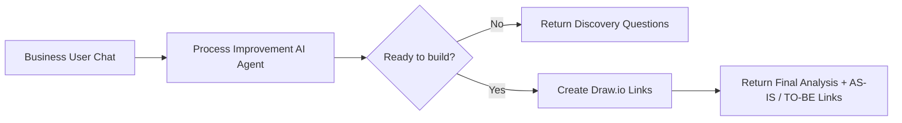

# AI Process Flow Improvement Agent

An n8n-based AI agent that helps Business Analysts, Business Systems Analysts, process owners, and technology teams analyze a current business process, identify evidence-supported bottlenecks, and design an improved future-state process.

The agent works interactively through n8n Chat. It asks discovery questions when information is incomplete, generates a structured AS-IS analysis, separates confirmed issues from hypotheses, recommends process/system/integration/automation improvements, and produces clickable **AS-IS** and **TO-BE** draw.io links directly in the chat response.

## What the Agent Does

- Performs business-process discovery before proposing a solution.
- Documents the current **AS-IS** process with sequential step numbers.
- Identifies confirmed issues, likely bottlenecks, rework, wait states, manual effort, ownership gaps, and integration opportunities.
- Separates facts from assumptions and root-cause hypotheses.
- Preserves required security, compliance, approval, audit, documentation, and human-oversight controls.
- Designs a traceable **TO-BE** process.
- Highlights AS-IS bottlenecks in **red** and new/materially improved TO-BE steps in **green**.
- Produces KPI recommendations and an implementation roadmap.
- Generates browser-ready draw.io links so users can open the process flows without copying Mermaid code.

## Final n8n Flow

The **Ready to build?** gate prevents process-flow generation until enough current-state information has been collected.

## How to Use

1. Download/import the workflow JSON from the `workflow` folder into n8n.
2. Open the **OpenAI Chat Model** node and select your OpenAI credential/model.
3. Review the **Process Improvement AI Agent** system message if you want to tailor discovery questions, analysis rules, or output sections.
4. Publish/activate the workflow.
5. Open the hosted n8n Chat URL.
6. Describe the process you want to analyze.
7. If the process is incomplete, the agent asks focused discovery questions and does **not** generate diagrams yet.
8. When enough information is available, the agent returns the final process-improvement analysis and two clickable links:
   - **Open AS-IS Process Flow in draw.io**
   - **Open TO-BE Process Flow in draw.io**
9. Open either link in a browser to view/edit the generated draw.io diagram.

## Recommended Process Information

For the best result, provide as much of the following as you know:

- Process name and business objective
- Trigger/start and end condition
- Current process steps
- Actors/owners
- Systems/applications
- Decisions, approvals, and handoffs
- Inputs/outputs
- Volume, processing time, wait time, and SLA
- Rework, defects, exceptions, or backlog
- Known pain points/bottlenecks
- Required controls, audit, security, or compliance requirements
- Desired outcome or improvement goal

You do not need to know everything. The agent is designed to ask follow-up questions when important information is missing.

## Short Test Case

Copy/paste the following into the agent:

### Process Name
Employee Software Access Request

### Business Objective
Provide employees access to approved software quickly while maintaining manager approval and security controls.

### Trigger
An employee submits a software access request.

### End
Access is granted or the request is rejected and documented.

### Process Steps
1. Employee submits a software access request in the service portal.
2. Manager reviews and approves or rejects the request.
3. Approved requests enter the IT Service Desk queue.
4. Service Desk manually checks whether the employee already has a license and whether the requested software is approved.
5. If information is missing, the Service Desk sends the request back to the employee for clarification.
6. Service Desk manually emails the Security team for approval when the software requires elevated access.
7. Security reviews the request and responds by email.
8. Service Desk updates the ticket manually with the Security decision.
9. If approved, Service Desk assigns the request to the Application Support team.
10. Application Support provisions the software.
11. Service Desk confirms access with the employee and closes the ticket.

### Known Bottlenecks
- **Bottleneck 1 — Step 4:** Manual license and software-approval checks take time and are repeated for many requests.
- **Bottleneck 2 — Steps 6–8:** Security approval is handled through email, creating waiting time and manual ticket updates.

### Current Metrics
- About 60 requests per day.
- Average completion time: 2 business days.
- About 15% of requests are returned because required information is missing.
- Security-related requests can wait 4–6 hours for approval.

### Controls That Must Remain
- Manager approval.
- Security approval for elevated-access software.
- Audit trail of approvals.
- Final access confirmation.

### Ask the Agent
> Analyze this process, identify the bottlenecks, create the AS-IS and TO-BE process flows, and recommend improvements while preserving the required controls.

## Expected Output

For a sufficiently documented process, the agent returns:

1. Executive Summary
2. Current Process Overview
3. AS-IS Process Steps
4. AS-IS Process Flow
5. Bottleneck and Root-Cause Analysis
6. Recommendations
7. TO-BE Process Steps
8. TO-BE Process Flow
9. KPI and Measurement Plan
10. Risks, Controls, Dependencies, and Assumptions
11. Implementation Roadmap
12. Clickable AS-IS and TO-BE draw.io links

## Key Design Principles

- **Discovery first:** no diagram is generated until the process is sufficiently understood.
- **Evidence-based analysis:** manual work is not automatically treated as a bottleneck.
- **Facts vs. hypotheses:** assumptions and root-cause hypotheses are clearly labeled.
- **Control preservation:** required approvals, security controls, auditability, and human oversight are retained.
- **Step traceability:** AS-IS and TO-BE tables use the same step numbers as their corresponding diagrams.
- **Editable output:** process flows open directly in draw.io for further refinement.

## Security and Usage Notes

- Do not commit API keys, credentials, tokens, or secrets to GitHub.
- The imported workflow requires the user to select their own OpenAI credential in n8n.
- Review your organization's data-handling requirements before entering confidential, regulated, or production-sensitive process information into an AI service.
- Review generated recommendations before implementation, especially when security, compliance, financial, or regulatory controls are involved.

## Workflow File

`workflow/Process_Improvement_AI_Agent_Drawio_Links.json`

## Author

**Muhammad N Sair**  
**Contact:** [NaumanSair@outlook.com](mailto:NaumanSair@outlook.com) | [www.linkedin.com/in/muhammad-sair](http://www.linkedin.com/in/muhammad-sair)
